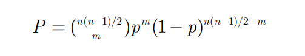
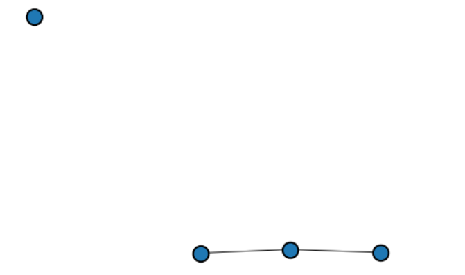
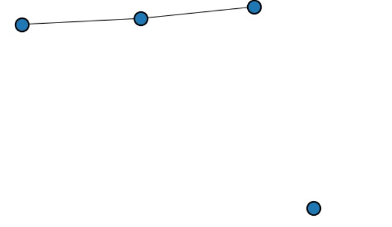
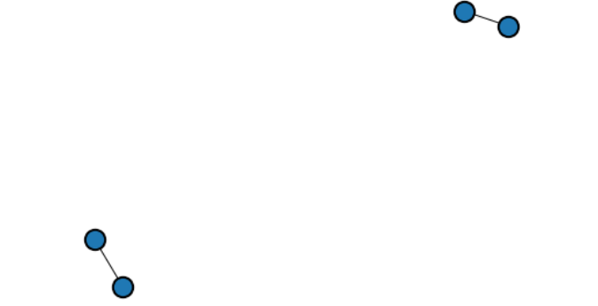
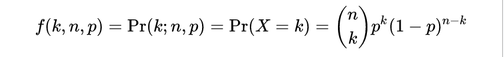
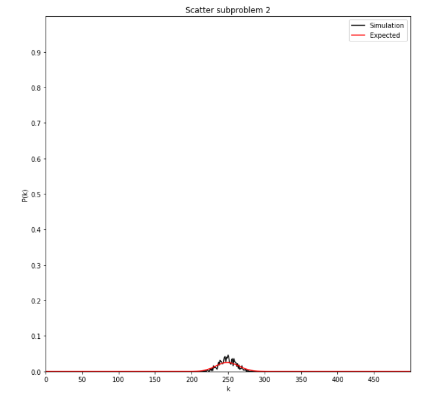
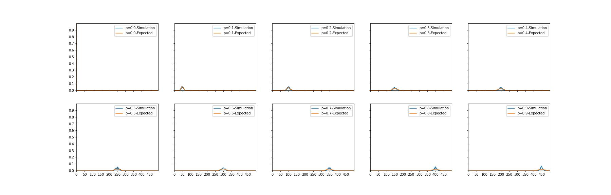
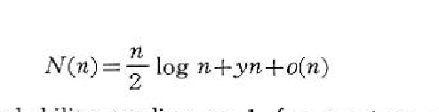
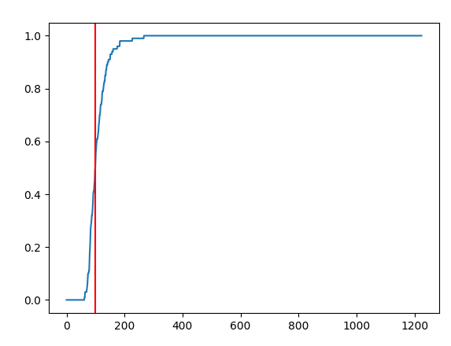
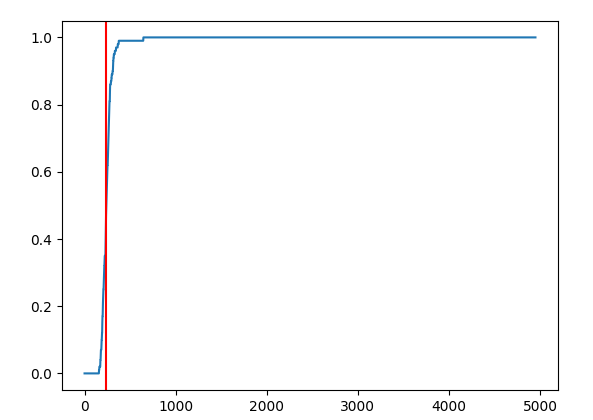

## گزارش پروژه‌ی اول شبیه سازی

+ روزبه شریف نسب 97243093
+ متین زیودار 972430


## خواسته ۱ (مدل تحلیلی)

نشان دهید احتمال اینکه در یک شبکه تصادفی ما دقیقا m لینک داشته باشیم برابر است با: 




دو مدل برای ساخت شبکه مطرح شد، مدل ER یا همان اردوش ارنی که با G(n,m) مشخص می‌شود و مدل ژیلبرت که با  G(n,p) مشخص می شود. نکته‌ای که وجود دارد این است که در مدل ژیلبرت، ما دقیقا n یال داریم که به شکل تصادفی توزیع شده‌اند و احتمال اینکه دقیقا m لینک داشته باشیم برابر ۱ است! پس نتیجه می‌گیریم چیزی که سوال خواسته، اثبات این فرمول در مدل اردوش-رنی است.


ما برای حل از مساله‌ی ظرف و گلوله استفاده نمی‌کنیم. بلکه به این شکل به مساله نگاه می‌کنیم:

ما کلا ` n*(n-1)/2` آزمایش متفاوت انجام می‌دهیم، که هر آزمایش معادل گذاشتن یال یا نگذاشتن یال بین دو راس متفاوت است.

ما می‌خواهیم احتمال این حالت را حساب کنیم که دقیقا m تا از آزمایش‌ها، موفقیت آمیز باشند (وجود یال) که احتمال این حالت می‌شود `p^m` اما تا اینجا در مورد بقیه آزمایش ها اظهار نظر نکردیم. باقی آزمایش ها که تعدادشان

 `n(n-1)/2 - m` است باید همگی ناموفق شوند و احتمال هر ناموفق شدن `p-1` است. بنابراین تا اینجا خواهیم داشت:

``` mathematica
p^m * (1-p)^(n(n-1)/2 - m)
```


اما احتمالی که از این حالت به دست بیاید بسیار بسیار کم است! چرا؟ چون این احتمال به وجود آمدن یک ترکیب خاص را می‌دهد، مثلا احتمال اینکه شکل زیر (n=4, m=2)



اما برای ما حالات مختلف چندان تفاوتی ندارند، مثلا مدلهای زیر هم قابل قبول هستند:



و




برای همین موضوع، ما باید تعداد حالاتی که برای ما قابل قبول است را در این عدد ضرب کنیم. برای ما انتخاب m از n(n-1)/2 قابل قبول است پس نتیجه نهایی می‌شود:

```mathematica
combination(n(n-1)/2, m) * p^m * (1-p)^(n(n-1)/2 - m)
```


توجه داریم که این توضیح بالا در واقع توضیح توزیع دوجمله‌ای است که می‌خواهیم m تا یال از بین n(n-1)/2 یال معتبر انتخاب کنیم در حالی که احتمال پیروزی هر آزمایش برابر p است.

یعنی در فرمول پایین، k=m و  n=تعداد کل یال ها یعنی n(n-1)/2 و p=p است.



-------------

متوسط تعداد یال‌ها به شکل تحلیلی:

در مدل ژیلبرت، احتمال وجود هر یال برابر p است، برای محاسبه‌ی متوسط تعداد یال می‌توان از **امید ریاضی** استفاده کرد. روش کار به این صورت است که می‌گوییم هر یال بین دو راس انتخابی به احتمال p وجود دارد. پس امید ریاضی تعداد یال ها، به این شکل محاسبه می‌شود:

```mathematica
E[X] = n*(n-1)/2 * p
```


برای تست کردن این موضوع از پکیج networkx کمک گرفته شد. به این شکل عمل شد که در بازه ی اعداد بزرگ (۲۰۰۰ تا ۳۰۰۰) برای n و p های مختلف بین ۰.۰۱ تا ۰.۹۹ انتخاب شد و محاسبه به دو شکل انجام شد. شکل شبیه سازی که گراف رندوم توسط networkx ساخته می‌شد و یکی از روش تئوری با فرمول بالا. اختلاف این دو روش در ۵۰ زوج مرتب‌های متفاوت همیشه کمتر از ۵ درصد بود (این موضوع به کمک assert پایتون بررسی گردید.)

برای تکمیل صحبت، خروجی برنامه در اینجا قرار داده می‌شود: (ستون ها به ترتیب: نتیجه واقعی، نتیجه مورد انتظار و اختلاف نسبی‌شان)

```
Act: 20017, exp: 19990, diff: 0.001
Act: 236417, exp: 237658, diff: 0.005
Act: 454557, exp: 455327, diff: 0.002
Act: 672899, exp: 672996, diff: 0.000
Act: 891532, exp: 890665, diff: 0.001
Act: 1107325, exp: 1108334, diff: 0.001
Act: 1325208, exp: 1326003, diff: 0.001
Act: 1544049, exp: 1543672, diff: 0.000
Act: 1761114, exp: 1761341, diff: 0.000
Act: 1978953, exp: 1979010, diff: 0.000
Act: 24166, exp: 24189, diff: 0.001
Act: 287051, exp: 287580, diff: 0.002
Act: 551484, exp: 550971, diff: 0.001
Act: 815376, exp: 814363, diff: 0.001
Act: 1077103, exp: 1077754, diff: 0.001
Act: 1341519, exp: 1341145, diff: 0.000
Act: 1605461, exp: 1604537, diff: 0.001
Act: 1866924, exp: 1867928, diff: 0.001
Act: 2131449, exp: 2131319, diff: 0.000
Act: 2394994, exp: 2394711, diff: 0.000
Act: 29066, exp: 28788, diff: 0.010
Act: 342139, exp: 342257, diff: 0.000
Act: 655074, exp: 655726, diff: 0.001
Act: 970633, exp: 969196, diff: 0.001
Act: 1282197, exp: 1282665, diff: 0.000
Act: 1596773, exp: 1596134, diff: 0.000
Act: 1909387, exp: 1909604, diff: 0.000
Act: 2222525, exp: 2223073, diff: 0.000
Act: 2537297, exp: 2536542, diff: 0.000
Act: 2849882, exp: 2850012, diff: 0.000
Act: 34104, exp: 33787, diff: 0.009
Act: 401035, exp: 401689, diff: 0.002
Act: 768013, exp: 769592, diff: 0.002
Act: 1136798, exp: 1137495, diff: 0.001
Act: 1505942, exp: 1505398, diff: 0.000
Act: 1874443, exp: 1873301, diff: 0.001
Act: 2240857, exp: 2241204, diff: 0.000
Act: 2609685, exp: 2609107, diff: 0.000
Act: 2976117, exp: 2977010, diff: 0.000
Act: 3345051, exp: 3344913, diff: 0.000
Act: 39342, exp: 39186, diff: 0.004
Act: 466922, exp: 465877, diff: 0.002
Act: 892296, exp: 892570, diff: 0.000
Act: 1319668, exp: 1319262, diff: 0.000
Act: 1745840, exp: 1745954, diff: 0.000
Act: 2170891, exp: 2172646, diff: 0.001
Act: 2599558, exp: 2599338, diff: 0.000
Act: 3026108, exp: 3026029, diff: 0.000
Act: 3452851, exp: 3452722, diff: 0.000
Act: 3879620, exp: 3879414, diff: 0.000
```


با توجه به اینکه در این n با توجه به بزرگی n، نتایج converge شده اند، همین تعداد شبیه سازی کافی است.

دقت داریم که اگرچه ما اینجا n را برابر ۲۰۰۰ تا ۳۰۰۰ گذاشتیم اما در واقع با n^2 سر و کار داریم که عدد بزرگی است. بزرگتر کردن n از ۳۰۰۰ باعث کندی محاسبات و مصرف زیاد مموری اصلی می‌شد برای همین صرف نظر شد.


کد مربوط به این قسمت با نام `1.py` قابل دسترس است.

---------------

# خواسته ۲: محاسبه توزیع درجه

با دادن پارامترهای مناسب به توزیع پواسون، اگرچه هنوز گسسته است ولی با n زیادش شکل توزیع نرمال می‌شود. البته باید دقت داشت که این پارامترها مشخص می‌کنند که چولگی به راست یا چپ نداشته باشد و متفارن باشد (درست مثل نرمال)

تعبیر به شکل ریاضی: توزیع دو جمله‌ای، با احتمال p موفقیت و 1-p ناموفقیت را خواهیم داشت. حالا احتمال اینکه تعداد موفقیت‌ها به تعداد کل نزدیک شود، حدود p^n است و چون p کوچک تر از ۱ است، با افزایش n احتمال بسیار کم می‌شود و دیدن تعداد موفقیت بالا impractical خواهد بود.


قسمت کدی: ما تقریب خواسته شده با استرلینگ را انجام دادیم و به یک عدد expected برای p(k) رسیدیم. در کنار نتیجه شبیه سازی در زیر قرار گرفته است:



و به شکل کامل تر داریم:



در شکل بالا توزیع درجه واقعی (حاصل از شبیه سازی) و توزیع درجه مورد انتظار حاصل از فرمول گفته شده برای p های مختلف رسم شده است.


# خواسته ۳ (تکامل یک شبکه تصادفی):

در این قسمت ما روش خودمون را پیاده سازی کردیم چون پیاده سازی پیشفرض networkx برای ما کافی نبود این پیاده سازی به ما یک باره نتیجه را می‌داد در حالی که ما می‌خواستیم تک تک یال اضافه کنیم و تکامل شبکه را ببینیم.

روش پیاده سازی به این شکل است که در هر مرحله تمام نایال های ممکن را گرفته و بین آن ها یکی را انتخاب کرده و آن را به شبکه اضافه می‌کنیم و چک میکنیم که آیا هم‌بند شده است یا خیر.

این کار را به تعداد زیاد انجام می‌دهیم و جایی که گراف هم‌بند شده را یادداشت میکنیم.

این کار را برای n های مختلف نیز جدا انجام می‌دهیم. با محاسبات ما و جست و جو به این نتیجه رسیدیم که قسمت critical که یک‌مرتبه گراف هم‌بند می‌شود حدود n * log(n) است (به طور دقیق تر n log(n) /2 )


مرجع ما مقاله‌ی جناب اردوش بود که هم‌بندی گراف را بررسی کرده است [1]

که در آن تصویر زیر به چشم می‌خورد:



برای همین ما از n * log(n) /2 استفاده می‌کنیم.

[1]: http://snap.stanford.edu/class/cs224w-readings/erdos60random.pdf	"مقاله‌ی جناب اردوش"


اسکرین شات های این قسمت:


برای n=50




برای n=20


برای n=100



----------


# خواسته ۲:

از اثبات قضیه صرف نظر می‌شود.

