# گزارش پروژه‌ی دوم شبیه سازی

+ روزبه شریف نسب 97243093
+ متین زیودار 972430

# فاز ۱

مراحلی که برای انجام فاز ۱ با توجه به روش مونت‌کارلو برای شبیه‌سازی دنبال شد به شکل زیر است:

- ابتدا دامنه احتمالی ورودی‌ها را بصورت خطی بین 0 و 1 تنظیم می‌کنیم.
- ورودی‌های متعلق به دامنه ذکرشده را بصورت تصادفی با فراخوانی تابع تولید گراف متناظر تولید می‌کنیم و سپس معیار مد نظر که احتمال کاهش‌پذیری (irreducablity) را محاسبه کنیم.
- سپس نتایج بدست آمده از هر مرحله را با هم جمع کردیم و در نهایت آزمایش را 1000 بار انجام دادیم و نتیجه نهایی را استخراج کردیم.

## تابع irreducible

اولین قدم برای ما این بود که تشخیص دهیم یک تابع irreducible هست یا نه. در ابتدا با توجه به دانسته ها و گفته های صورت پروژه اقدام به پیاده سازی دقیق الگوریتم خواسته شده کردیم. 

برای این کار از numpy استفاده شد.

اما در ادامه متوجه شدیم که چنین تابعی در خود networkx پیاده سازی شده و بهتر و دقیق تر است که از همین تابع استفاده کنیم. در نهایت تابع ما چیزی شبیه تصویر زیر شد: 

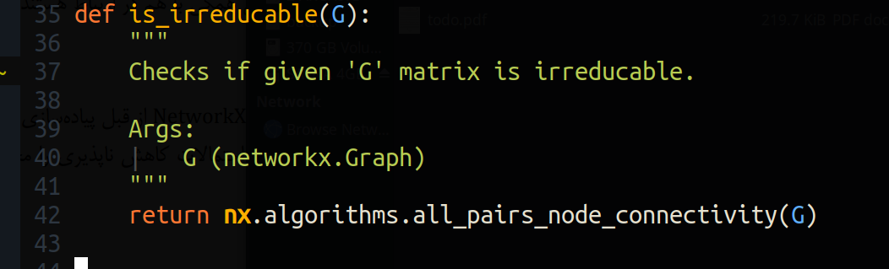

نکته چالش بر انگیز این قسمت پیدا کردن الگوریتم مورد نظر در کتابخانه networkx بود.

## انجام یک بار آزمایش

دومین گام ساخت یک گراف ER و انجام ازمایش برای p های مختلف بود. یک ارایه نامپای از p های مختلف درست شد.

سپس به ازای هر p شبیه سازی انجام شد. اما مجبور بودیم که فقط یک n را بگیریم در این مرحله.

## ساخت گراف 

در صورت سوال از ما ۳ نوع گراف مختلف خواسته شده بود.

برای اینکه بتوانیم این گراف ها را بسازیم از توابع networkx استفاده کردیم.

اما مشکل این بود که کاربر قرار بود مشخص کند چه گرافی ساخته شود. برای این منظور یک map از کلیدی که کاربر وارد می‌کرد به تابع (lambda)یی که گراف مربوطه را می‌ساخت ساختیم. 

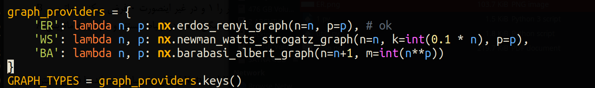

البته کمی این قسمت چالش برانگیز است که در جلوتر توضیح می‌دهیم.

## انجام ازمایش برای گراف های مختلف و n های مختلف در p های مختلف 

قدم بعدی این بود که از این گراف های ساخته شده استفاده کنیم و همچنین n متغیر را بگیریم. برای این منظور ۱۰ n متفاوت در نظر گرفته شد که ازمایش را برای هر کدام از این n ها تکرار کردیم.

سپس با کمک کتابخانه matploitlib یک فیگور ۱۰ تایی ساخته شد که در هر کدام یک n بررسی می‌شود. 

## محاسبه به کمک روش تئوری 

در نهایت محاسبه به کمک تئوری نیز حساب شد. 

یکی از قسمت های تئوری متاسفانه همانطور که گفته شد بسیار زمان بر بود (تصویر زیر)

هرچند که توابع کمکی خوبی نیز در networkx وجود داشت برای نمونه تمام زیر گراف ها اما محاسبه به ازای هر کدام بسیار زمان بر می شد. بنابراین فعلا از رسم گراف برای آن طرف نظر شد

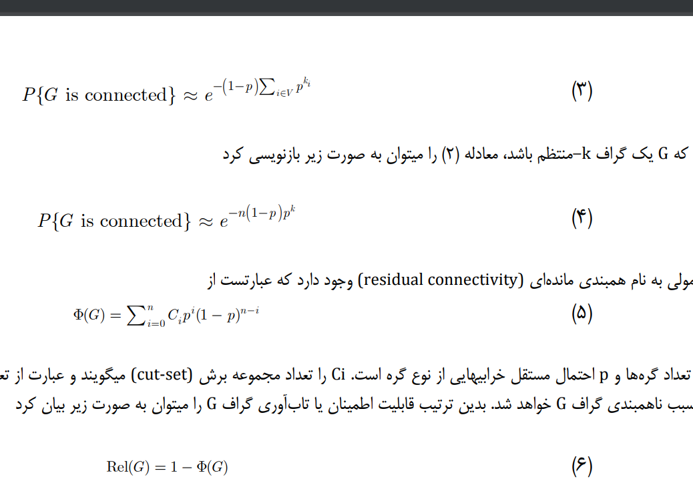

در این قدم روش محاسبه‌ای بر اساس فرمول به گراف اضافه گردید.

## تعداد تکرار epoch

کار ما اما همینجا تمام نمی شود. کاری که باید انجام دهیم تکرار شبیه سازی است. با تکرار شبیه سازی به تعداد بالا به کمک قانون اعداد بزرگ از صحت جواب هایمان مطمئن می‌شویم و نویز خروجی را کاهش می‌دهیم.

برای اینکار از همان epoch گفته شده در صورت سوال استفاده شد. 

در هر مرحله به تعداد گفته شده گراف ساخته می‌شد و بینشان میانگین معمولی (جبری) گرفته می شد و آن عدد به عنوان معیار دخیره می‌شد.

## بررسی نتایج

اکنون که شبیه سازی برای این فاز تمام شده نوبت به تفسیر و بررسی نتایج می‌رسد.

بهترین حالت  برای شباهت تئوری و شبیه سازی گراف های ER است. مخصوصا در تعداد n های بالا می‌بینیم که بسیار به هم نزدیک شده اند و نتیجه بسیار خوب است. 

نتیجه n های مختلف برای گراف ER

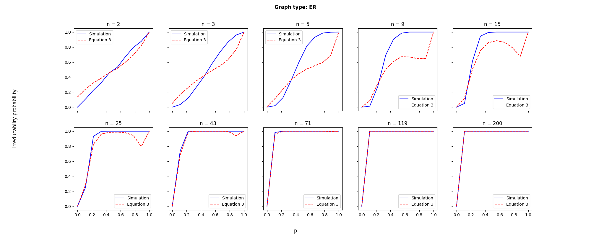

اما متاسفانه برای گراف های BA و ES به چنین نتیجه خوبی نرسیدیم. 

(تصاویر زیر)

دلیل این امر می‌تواند این باشد که ما با داشتن n,p راحت می‌توانستیم گراف ER رسم کنیم اما در گراف های دیگر پارامترها با N,P که ما داشتیم شباهت نداشتند و مجبور بودیم به روش تقریبی و چشمی آن ها را تولید کنیم و احتمالا در این مورد اشتباه کرده ایم.

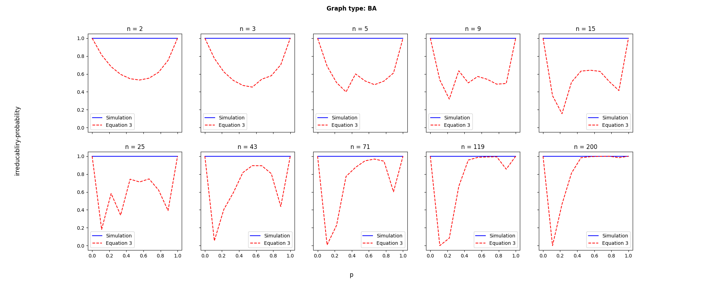

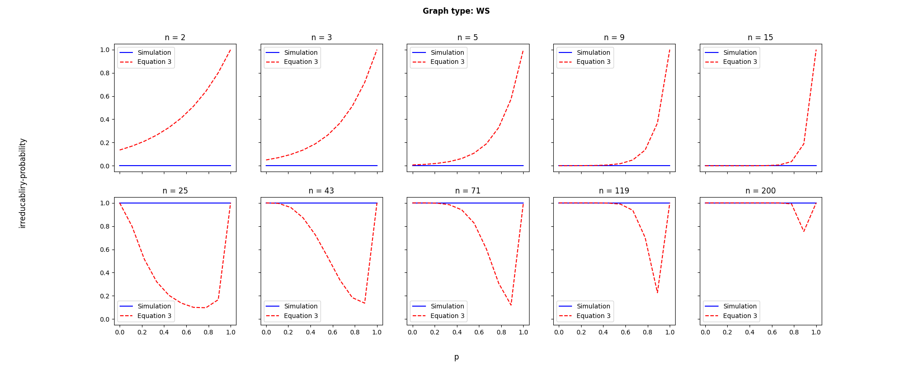

## محاسبه فاصله اطمینان
با توجه به اینکه داده‌های تولیدی ما از 35 بیشتر هستند در نتیجه از توزیع t-استیودنت استفاده نمی‌کنیم و از رابطه زیر استفاده می‌کنیم. انحراف معیار داده‌های تولیدشده برابر با 0.3 هستند و همچنین ازآن‌جایی که آزمایش 100 بار تکرار کردیم در نتیجه فاصله اطمینان برابر است با

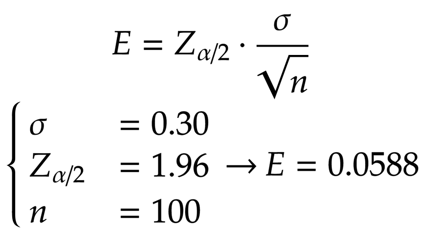

-----

# فاز ۲

مراحلی که برای انجام فاز ۲ دنبال شد به شکل زیر است:

## قسمت الف)

## تابع calculate_survival_time

اولین قدم برای ما این بود که با استفاده از توزیع داده‌شده (که یا pareto است یا exponential)، گره‌ها را بر حسب زمان بقا (زنده ماندن) آن‌ها مرتب می‌کنیم و سپس به ترتیب زمان را جابجا می‌کنیم.

در واقع اینجا انگار یک شبیه‌سازی پیشامد-گسسته انجام می‌دهیم و در هر event بررسی می‌کنیم که آیا گراف زنده مانده‌است یا خیر.
 باید به این نکته توجه کنیم که بین هر event، مدل پایدار است در نتیجه مشکلی برای شبیه‌سازی به وجود نمی‌آید. در نمودار زیر می‌توانید متوسط زمان زنده ماندن (بقا) بر اساس 1000 آزمایش را بر حسب میانگین درجه گره‌ها \<k\> مشاهده کنید.

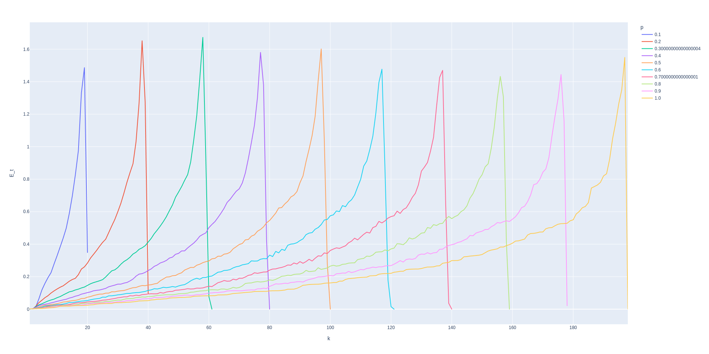

همانگونه که قابل مشاهده است، با افزایش میانگین درجه گره‌ها، میانگین زنده‌ماندن درجات تفاوت زیادی نمی‌کند.

## قسمت د

## تابع simulate_isolation_by_distribution
هدف این تابع پیدا کردن ارتباط بین پیشامد ایزوله‌شدن شبکه (phi) و توزیع طول عمر نمایی (exponential) و pareto است. ابتدا به ازای هر یک از توزیع‌های داده‌شده، اعداد تصادفی را می‌سازیم که برای این کار از کتاب‌خانه `scipy` استفاده کردیم که در آن توابع pdf مربوط به توزیع‌ها پیاده‌سازی شده‌اند. که رابطه آن‌ها در شکل زیر آورده شده‌است.

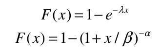

سپس به ازای هرکدام از اعداد تصادفی تولید شده، آزمایش خود را به اندازه 100 بار تکرار می‌کنیم.

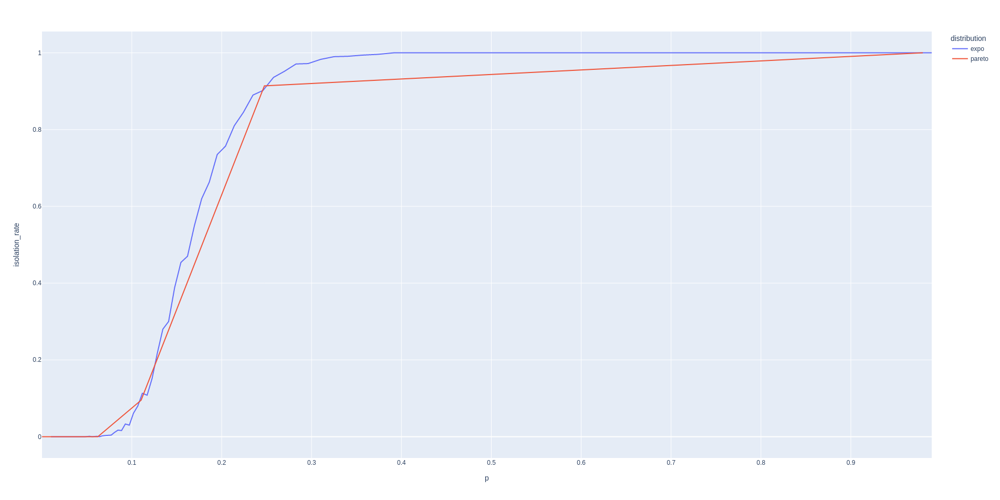

همانگونه که در شکل مشخص است، احتمال ایزوله شدن در شبکه تولیدی با توزیع pareto کمتر از احتمال ایزوله شدن در شبکه تولیدی با توزیع exponential است. 

در اینجا باید پرسید که چرا ۱۰۰ مرتبه تکرار می‌کنیم؟

وقتی ما ۱۰۰ مرتبه تکرار کنیم ۱۰۰ داده داریم که میانگین آن ها آماره ماست.

حالا این آماره با باید مقایسه گردد که میانگین یکسانی داشته باشد. 

فرض 0 یا همین H0 ما این است که میانگین یکسانی دارند

فرض خلف یا H alternative این است که میانگین یکسانی ندارند. 

در نهایت ما p value را حساب می‌کنیم که با چه دقتی (فاصله اطمینانی) به بالا میانگین یکسانی دارند. 

## قسمت ه)

## تابع simulate_isolation_survival_by_pareto_shape
هدف از این تابع بررسی تاثیر مقادیر پارامترهای شکل (alpha) بر احتمال ایزوله شدن (phi) و متوسط زمان بقا (E_t) است. برای تعیین پارامتر شکل (alpha) از تابع `np.geomspace` استفاده کردیم و بازه آن‌ را بین 0.01 تا 10 قرار دادیم برای 100 مقدار مختلف. سپس با استفاده از کتابخانه `scipy` مقادیر تصادفی را بر حسب توزیع پارتو تولید کردیم و سپس در آن‌ها به بررسی نرخ ایزوله‌شدن و متوسط زمان بقا پرداختیم. گرافی که برای شبیه‌سازی انتخاب کردیم، گراف ER است.

نمودار متوسط زمان بقا بر حسب شکل (alpha) به شکل زیر است. همانگونه که در نمودار قابل مشاهده‌است، با افزایش پارامتر شکل، اعداد تصادفی تولید‌شده بازه بیشتری را دربر می‌گیرند و همچنین متوسط زمان بقا افزایش پیدا می‌کند. 

نمودار احتمال ایزوله‌ شدن بر حسب شکل بصورت زیر است. همانگونه که در نمودار قابل مشاهده است، احتمال ایزوله شدن با تغییر پارامتر شکل، تغییری نمی‌کند.

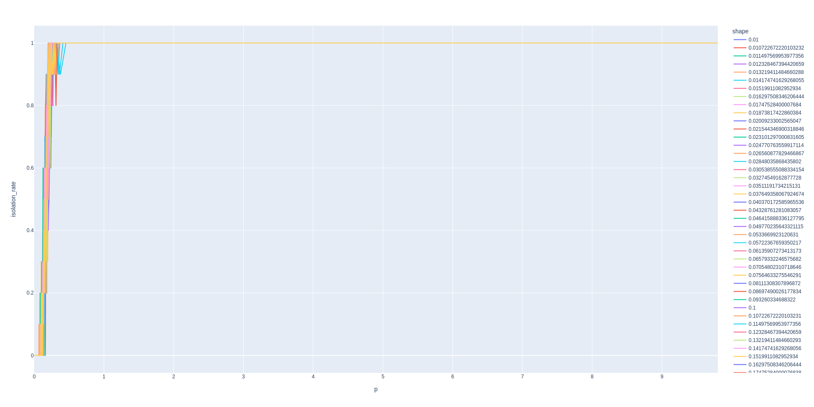

برای آنکه بتوانیم یک نمودار خوب و گویایی داشته باشیم، نمودار 3بعدی آن را رسم کردیم که بصورت زیر است.

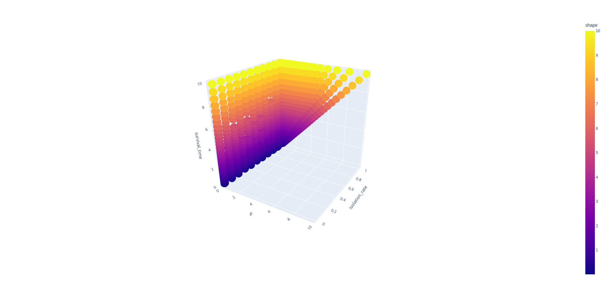

البته این هم یک تصویر دوبعدی از نمودار است و بهتر است هنگام تحویل خود نمونه سه بعدی نمایش داده شود!